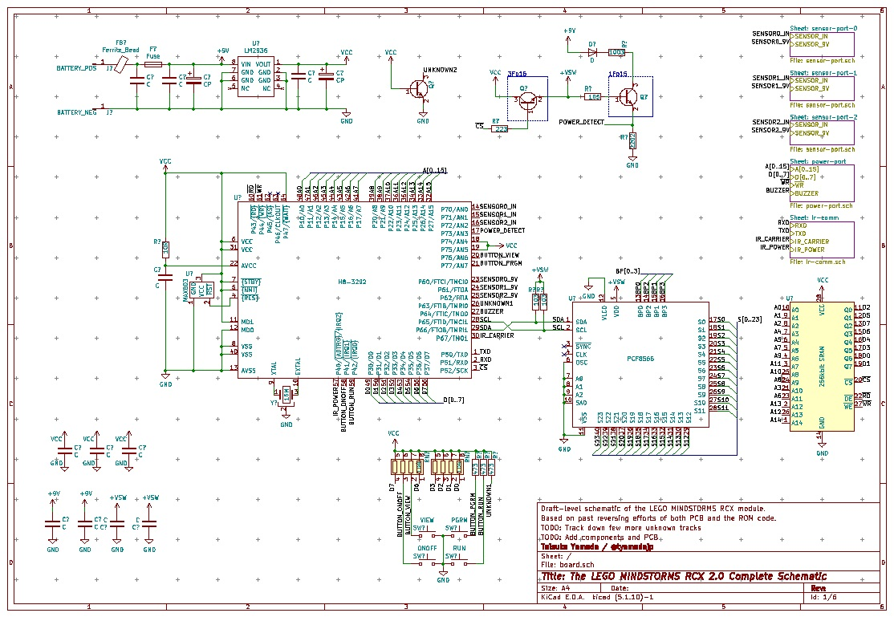

# lego-rcx

This is an effort to revive the original LEGO MINDSTORMS RCX.

My plan is to mod the hardware to add I2C (add secondary bus or bring out the internal one) and also get brickOS (or bibo) to support it.
